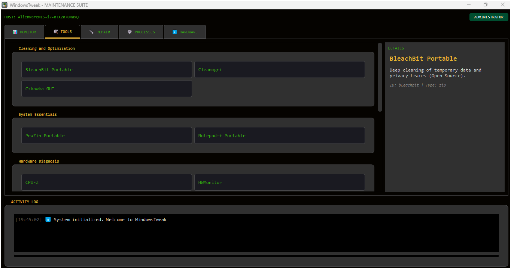
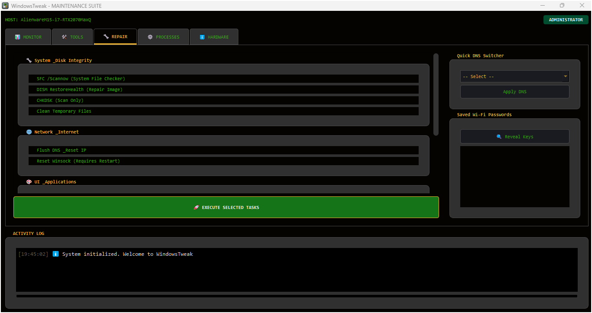
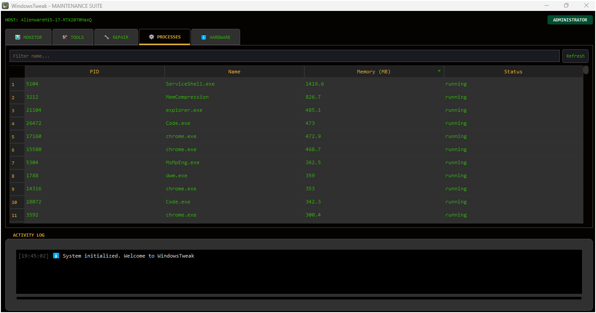
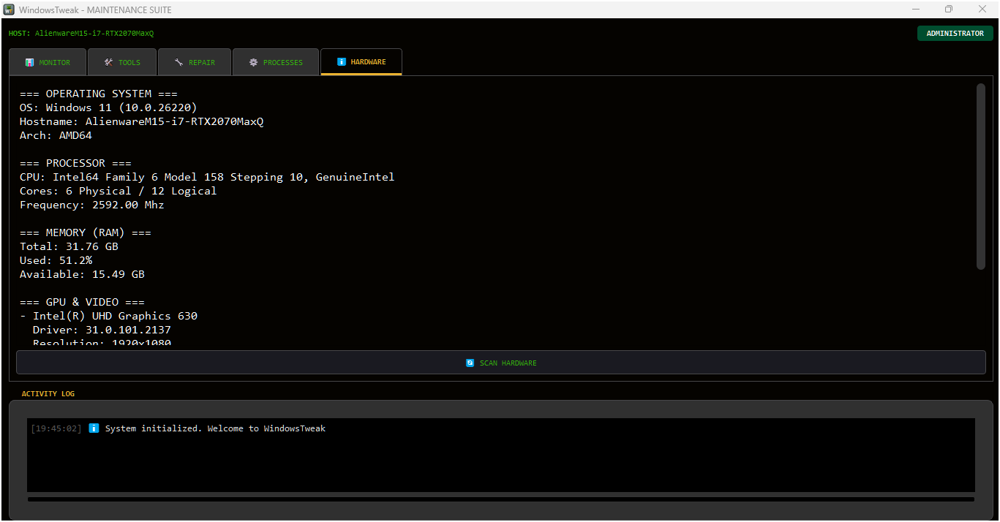

# WindowsTweak Banner

 

**WindowsTweak** is a consolidated, high-performance maintenance suite designed for **system monitoring, portable tool management, and automated repair**.
Built with **PyQt5**, it offers a modern dark-themed interface to manage Windows processes, network configurations, and hardware diagnostics without installation.

---

## 🖼️ Interface Previews

  
  

  
  

  

---

## ✨ Key Features

- **📊 Real-Time Telemetry** – Custom-drawn graphs using `QPainter` for CPU, RAM, Disk, and Network traffic monitoring with history tracking.
- **🛠️ Portable Tool Hub** – Integrated downloader for essential utilities like **BleachBit, CPU-Z, AdwCleaner, and Sysinternals Suite**. It manages downloads, extraction (ZIP), and execution within a sandbox folder (`DeckTools`).
- **🔧 System Repair Automation** – One-click execution for standard Windows repair commands:
  - **SFC & DISM** image restoration.
  - **Windows Update** component reset (Service toggling and SoftwareDistribution cleanup).
  - **Icon Cache** & **Print Spooler** reset.
- **🌐 Network Utilities** – Quick DNS Switcher (Google/Cloudflare/DHCP) and a **Wi-Fi Password Revealer** that parses WLAN profiles.
- **⚙️ Process Manager** – A lightweight task manager to filter, suspend, resume, or kill processes with high-precision memory stats.
- **ℹ️ Hardware Deep Scan** – Utilizes `WMI` and `psutil` to retrieve motherboard serials, GPU driver versions, BIOS info, and battery health reports.

---

## 🖥️ System Requirements

| Component        | Specification                                          |
| :--------------- | :----------------------------------------------------- |
| **OS**           | Windows 10 / 11 (Admin Rights Recommended)             |
| **Python**       | 3.8+ (If running from source)                          |
| **Dependencies** | PyQt5, psutil, requests, wmi, pywin32 (Auto-installed) |
| **Network**      | Required for Tool downloading and DNS features         |

---

## 📜 License

**WindowsTweak** is licensed under the **MIT License**.

### 📊 Integrated Libraries & Tools

| Component        | License        | Usage in WindowsTweak                           |
| :--------------- | :------------- | :---------------------------------------------- |
| **PyQt5**        | GPL v3         | Core GUI Framework                              |
| **psutil**       | BSD            | System Monitoring & Process Management          |
| **requests**     | Apache 2.0     | Downloading Portable Tools                      |
| **WMI**          | MIT            | Hardware Information Retrieval                  |
| **Sysinternals** | Microsoft EULA | Optional downloadable tools (Autoruns, ProcExp) |
